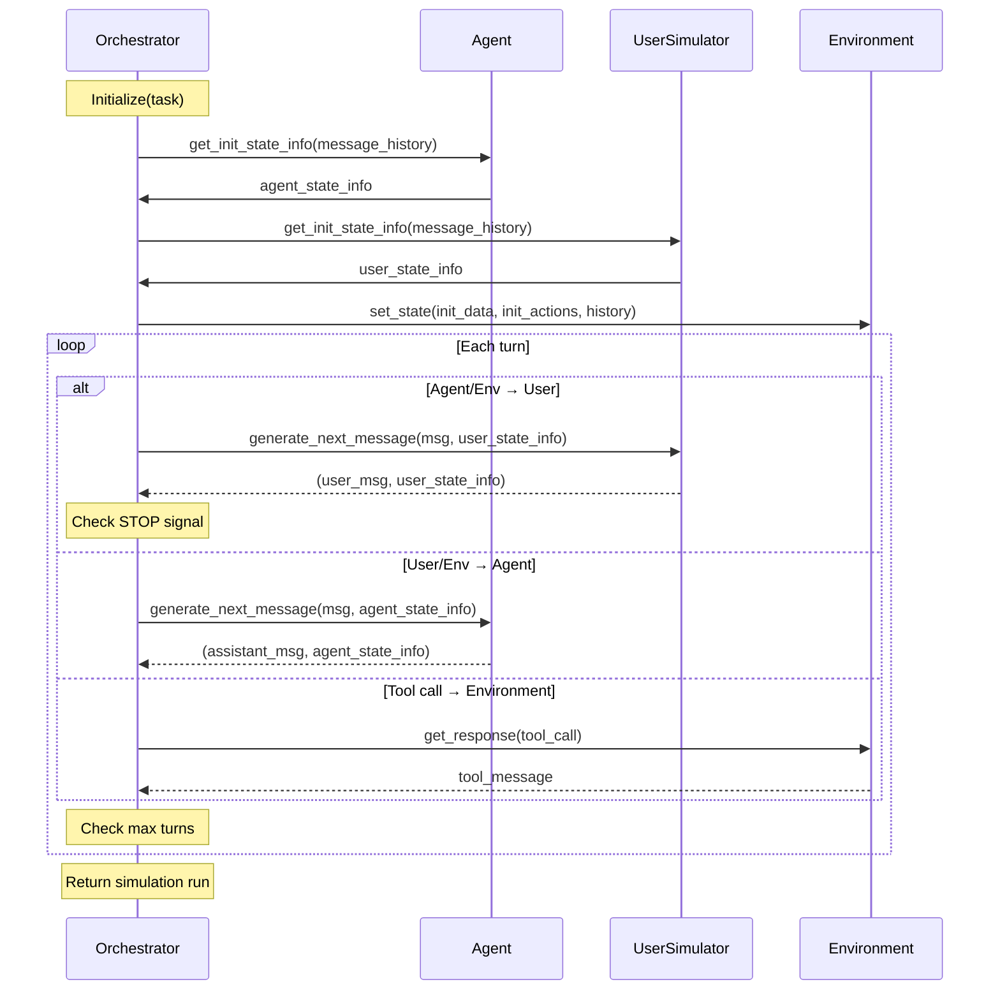

# AgentChangeBench

**A Multi-Dimensional Evaluation Framework for Goal-Shift Robustness in Conversational AI**

[](https://arxiv.org/abs/2510.18170)
[](https://arxiv.org/abs/2510.18170)
[](https://www.python.org/downloads/)
[](https://github.com/astral-sh/uv)
[](https://github.com/astral-sh/ruff)

---

## Table of Contents

- [Motivation](#motivation)
- [What's in the Benchmark](#whats-in-the-benchmark)
- [Evaluation Metrics](#evaluation-metrics)
- [Key Findings](#key-findings)
- [Domains](#domains)
- [Installation](#installation)
- [Quick Start](#quick-start)
- [CLI Reference](#cli-reference)
- [Evaluate Your Own Agent](#evaluate-your-own-agent)
- [Simulation Architecture](#simulation-architecture)
- [Citation](#citation)
- [Authors](#authors)
- [License](#license)

---

## Motivation

Most LLM agent benchmarks assume user goals stay fixed throughout a conversation. This oversimplifies real-world deployments, where users frequently re-prioritize tasks, introduce new constraints, or shift objectives mid-dialogue. For example, a banking customer might authenticate their identity, pivot to reviewing transactions, and then escalate to disputing a fraudulent charge, all in one interaction.

**AgentChangeBench** is the first benchmark explicitly designed to test how tool-augmented agents detect, adapt to, and recover from mid-conversation goal shifts, while also measuring how well they tailor communication to users with different levels of expertise, cooperation, and trust.

> Accepted to the [NeurIPS 2025 Workshop on Multi-Turn Interactions in Large Language Models](https://arxiv.org/abs/2510.18170).

---

## What's in the Benchmark

- **315 systematically validated tasks** across 3 enterprise domains, each annotated with explicit goal sequences
- **2,835 task sequences** total, generated across trials and personas
- **5 user personas** (`EASY_1`, `EASY_2`, `MEDIUM_1`, `MEDIUM_2`, `HARD_1`) varying in expertise, cooperation, and trust, each designed to trigger realistic shift points
- **3 evaluation domains:** banking, retail, and airline

---

## Evaluation Metrics

AgentChangeBench goes beyond binary `pass@k` scores with four complementary metrics:

### Task Success Rate (TSR)
Measures whether the agent completed the intended task via a weighted average across three evaluation channels:

```
TSR = 0.25 × communicate_info_rate + 0.45 × action_rate + 0.30 × nl_assertion_rate
```

### Tool Use Efficiency (TUE)
Combines tool correctness `T` (fraction of tool calls that execute successfully) and parameter validity `P` (fraction of calls whose arguments satisfy the schema):

```
TUE = 0.6 × T + 0.4 × P
```

### Tool Call Redundancy Rate (TCRR)
Measures wasted effort; how many tool calls were redundant after a goal shift occurred.

### Goal-Shift Recovery Time (GSRT)
Measures adaptation latency: turns from a user goal shift to acknowledgment, first relevant tool call, and task completion. **Lower is better.**

### How AgentChangeBench compares to τ²-bench

| Feature | τ²-bench | AgentChangeBench |
|---|---|---|
| Goal dynamics | Static | Mid-dialogue shifts |
| Persona coverage | Limited | 5 distinct personas |
| Primary metric | `pass@k` | TSR, TUE, TCRR, GSRT |
| Tool evaluation | Basic | Correctness + validity + redundancy |
| Recovery measurement | ❌ | ✅ |

---

## Key Findings

Experiments across GPT-4o, Claude-3.7-Sonnet, and Gemini-2.5-Flash reveal sharp contrasts hidden by traditional accuracy metrics:

- **Claude-3.7-Sonnet recovers fastest** from goal shifts across all domains
- **GPT-4o** delivers the most balanced cross-domain performance, reaching **92.2% recovery** on airline booking goal shifts
- **Gemini-2.5-Flash** drops to **48.6% recovery** in banking but remains competitive in retail
- **Retail tasks** show near-perfect parameter validity yet **redundancy rates above 80%**. Agents kept making unnecessary tool calls even after achieving what they needed

> High raw accuracy does not imply robustness under dynamic goals. Measuring recovery time and redundancy is essential.

---

## Domains

Each domain defines a policy the agent must follow, a set of available tools, and a set of goal-shifted task sequences. The `mock` domain is a sandbox for development.

| Domain | Description |
|---|---|
| `banking` | Identity auth → transaction review → fraud dispute workflows |
| `retail` | Order management and product inquiries with mid-session pivots |
| `airline` | Flight booking, changes, and cancellations |
| `mock` | Minimal sandbox for development and testing |

---

## Installation

**Requires Python 3.10+**

```bash
# 1. Clone the repository
git clone https://github.com/Maniktherana/AgentChangeBench
cd AgentChangeBench

# 2. Install with uv
uv sync
```

This installs all dependencies and enables the `tau2` CLI.

> **Note:** If you use `uv pip install .` instead of `uv sync`, set the data directory manually:
> ```bash
> export TAU2_DATA_DIR=/path/to/your/tau2-bench/data
> ```

Verify your setup after installation:

```bash
tau2 check-data
```

Clean generated files and the virtual environment:

```bash
make clean
```

---

## Quick Start

### 1. Configure API Keys

AgentChangeBench uses [LiteLLM](https://github.com/BerriAI/litellm), so any LiteLLM-compatible LLM provider works.

```bash
cp .env.example .env
# Edit .env with your API keys
```

### 2. Run a Test Evaluation

Run a quick evaluation on 5 tasks with 1 trial each:

```bash
tau2 run \
  --domain airline \
  --agent-llm gpt-4.1 \
  --user-llm gpt-4.1 \
  --agent llm_agent \
  --user banking_user_simulator \
  --num-trials 1 \
  --num-tasks 5
```

Results are saved to `data/tau2/simulations/`.

---

## CLI Reference

### Run Benchmark

```bash
tau2 run \
  --domain <domain> \
  --agent-llm <llm_name> \
  --user-llm <llm_name> \
  --num-trials <trial_count> \
  --task-ids <task_ids> \
  --max-concurrency <concurrent_sims>
```

### View Results

```bash
tau2 view
```

Browse simulation files, view per-metric agent performance, inspect individual simulations, and explore task details.


### Check Data Configuration

```bash
tau2 check-data
```

---

## Evaluate Your Own Agent

To plug in a local or remote custom agent, see the [agent developer guide](src/tau2/agent/README.md). All domain-specific policy and API documentation accessible to agent developers is available via `tau2 domain <domain>`.

---

## Simulation Architecture

The orchestrator passes messages between a user simulator, an agent, and a domain environment. On each turn, one of three transitions occurs:



---

## Citation

If you use AgentChangeBench in your research, please cite:

```bibtex
@misc{rana2025agentchangebench,
  title        = {AgentChangeBench: A Multi-Dimensional Evaluation Framework for Goal-Shift Robustness in Conversational AI},
  author       = {Manik Rana and Calissa Man and Anotida Expected Msiiwa and Jeffrey Paine and Kevin Zhu and Sunishchal Dev and Vasu Sharma and Ahan M R},
  year         = {2025},
  eprint       = {2510.18170},
  archivePrefix = {arXiv},
  primaryClass = {cs.AI},
  url          = {https://arxiv.org/abs/2510.18170}
}
```

---

## Authors

Manik Rana · Calissa Man · Anotida Expected Msiiwa · Jeffrey Paine · Kevin Zhu · Sunishchal Dev · Vasu Sharma · Ahan M R

---

## License

[MIT License](LICENSE)
